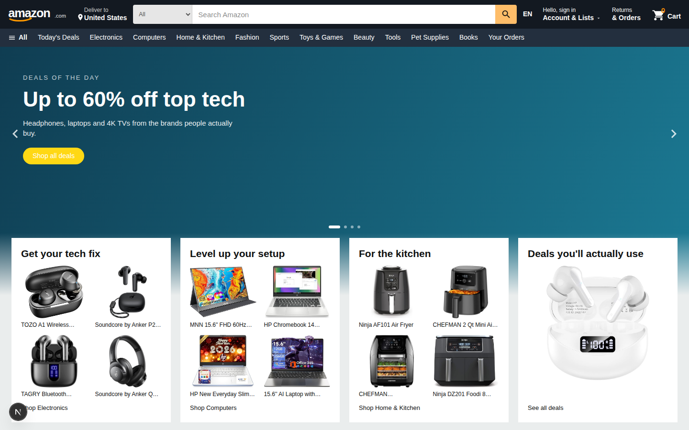

# Amazon Clone

A rebuild of [amazon.com](https://www.amazon.com) — the core shopping flow, built from scratch in 24 hours.

**Live:** _(deploying — link goes here)_



---

## What this is

A working storefront, not a landing page. You can search 268 real products
across 10 departments, filter them, read a product page, fill a cart as a
guest, create an account, check out, and see the order in your order history.
Reviews you write persist and are attributed to you.

Everything behind the UI is real: the catalogue is scraped from live
amazon.com search results, and identity, carts, orders and reviews live in
Postgres with row-level security.

## Running it

```bash
npm install
cp .env.example .env.local   # add your Supabase URL + publishable key
npm run dev
```

The app runs without Supabase configured — the catalogue, search, product
pages and a cookie-backed guest cart all work. Only accounts, orders and
reviews need the database, and their absence degrades rather than crashes.

```bash
npm run build        # production build
node scripts/e2e.mjs           # guest cart flow (11 checks)
node scripts/e2e-checkout.mjs  # register -> checkout -> order (11 checks)
node scripts/shot.mjs '[{"name":"home","path":"/"}]'   # screenshot routes
```

## What's built

| Flow | Notes |
| --- | --- |
| **Home** | Auto-advancing hero, category cards overlapping the fade, product rails |
| **Search** | Department / rating / price / brand / Prime / deals facets, 6 sort orders, pagination |
| **Product** | Gallery with cursor zoom, buy box, variants, about-this-item, reviews with histogram |
| **Cart** | Quantity, save for later, subtotal, free-shipping threshold, empty state |
| **Auth** | Sign in, create account, guest-cart merge on sign-in |
| **Checkout** | Single page: address, payment, review, live order summary |
| **Orders** | Order history and detail with a delivery progress bar |
| **Extras** | Deals, wish list, account, 404 |

## Architecture

**Next.js 16 (App Router) · React 19 · TypeScript · Tailwind v4 · Supabase**

The one decision worth explaining: **the product catalogue is not in Postgres.**
It is a static JSON file imported at build time, so search, filtering and
faceting run in-process with no network hop. 268 products is small enough that
a linear scan beats any index, and it means the storefront keeps working if
the database is unreachable.

Postgres owns only what is genuinely per-user and must persist: profiles,
addresses, carts, wish lists, orders and reviews. Every table has row-level
security; the policies are in [`supabase/migrations/0001_init.sql`](supabase/migrations/0001_init.sql).

A few other choices:

- **Search state lives entirely in the URL.** Every filter is a plain link, so
  results are server-rendered, shareable, back-button correct, and work with
  JavaScript disabled. Facet counts are computed per-dimension, so ticking one
  brand doesn't collapse the brand list to that brand.
- **Carts have two backends behind one interface.** Guests get a cookie;
  signed-in shoppers get Postgres. `mergeGuestCart` folds one into the other
  at sign-in, summing quantities rather than overwriting.
- **Order line items are snapshots.** Title, image and price are copied onto
  the order, so an order always shows what was actually bought even after the
  catalogue changes.
- **Plain ``, not `next/image`.** The CDN already serves correctly-sized
  renditions, and it removes a class of deploy-time image-optimisation failure
  from a demo that has to work in front of a reviewer.

## The data

`scripts/build-catalog.mjs` turns raw scraped search results into
`src/data/products.json`. The raw scrape is vendored in `scripts/raw/`, so the
build is reproducible from the repo alone:

```bash
node scripts/build-catalog.mjs scripts/raw
```

**Real:** titles, prices, list prices, star ratings, review counts,
bought-in-past-month figures, badges and product images (served from Amazon's
CDN).

**Derived, deterministically per ASIN so it never changes between builds:**
department, feature bullets, variant options and stock counts.

**Honest caveats**, because a reviewer will spot them:

- **39 of 268 prices are synthesised.** Amazon returns a price *range* rather
  than a number for multi-variant listings (most shoes) and `0` for
  Kindle/Audible editions. Where the scrape had no number, the build generates
  a stable one inside a department-appropriate band.
- **Review text is generated**, drawn from per-department pools and rotated so
  no page repeats itself. The scrape doesn't include review bodies. The star
  histogram, though, is solved against each product's **real** average, so the
  bars and the headline number agree.
- **One photo per product.** A search scrape only returns the primary image,
  so the PDP hides its thumbnail column rather than showing one photo three
  times.

## Deliberately not built

Scope cuts, and why:

- **Real payments.** Checkout takes any card number and stores only the last
  four digits, to render the order page. Wiring Stripe would have cost hours
  and demonstrated Stripe, not product judgement.
- **A seller marketplace.** Multiple offers per listing, seller accounts and
  fulfilment are most of Amazon's actual complexity and none of its first-run
  experience.
- **Variant catalogues.** The colour/size pickers are presentational: one ASIN
  per listing is all the scrape gives, and inventing a variant matrix would be
  fabrication.
- **Returns, Prime signup, recommendations, Alexa/devices, video, grocery.**
  Breadth that wouldn't have improved the core purchase flow.

## Agent logs

`.agent-logs/` holds the prompts and responses from the coding session that
built this, committed incrementally as the work happened. `scripts/capture.mjs`
writes them and scrubs credentials before anything lands on disk — the logs are
public, and a session inevitably contains tokens.

---

_Not affiliated with Amazon. Product data and imagery are scraped from public
Amazon search results for demonstration purposes._
